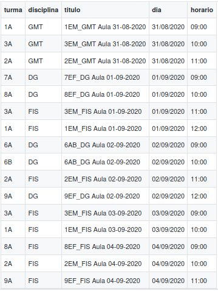

# Maestro: aula digital 
Criação automatizada de aulas digitais na plataforma **Maestro** da [Somos Educação](https://www.somoseducacao.com.br/).

## Visão geral

Durante o período de isolamento social imposto pela COVID19, estamos ministrando aulas remotamente, dentro do modelo de *Ensino Remoto Emergencial*. A instituição de ensino na qual leciono utiliza material didático do [Sistema Anglo de Ensino](https://portal.sistemaanglo.com.br). Tal sistema possui diversos recursos digitais, sendo a plataforma **Maestro** um deles. Ao final do mês de março, uma grande reestruturação passou a permitir a criação de *videoconferências* diretamente pelo Maestro, nomeadas de **aulas digitais**, utilizando os serviços do [Google Meet](https://meet.google.com).

A criação de aulas digitais é bastante simples, bastando selecionar algumas informações correspondentes à turma na qual a aula será ministrada. Apesar disto — e fica aqui minha nota de agradecimento à equipe de desenvolvimento, que vem trabalhando incansavelmente! — este processo é *maçante*: as aulas ocorrem semanalmente nos mesmos dias e nos mesmos horários, mudando apenas as datas.

Foi pensando nisto que surgiu este pequeno script `auladigital.py`.


## Instalação

Clone este o repositório:

`git clone https://github.com/pbittencourt/workflow.git`

O script se encontra no subdiretório `maestro/`. O restante corresponde a outros scripts que utilizo para otimizar meu fluxo de trabalho — e que [você pode conferir](https://github.com/pbittencourt/workflow) na raiz deste repositório.

Se você não possui módulo [selenium](https://selenium-python.readthedocs.io/) instalado, pode fazê-lo via *pip*:

`pip install -m selenium`

Para maiores detalhes e problemas relacionados à instalação, recomendo uma [leitura na documentação](https://selenium-python.readthedocs.io/installation.html). Também será necessário baixar o [driver correspondente a seu navegador](https://selenium-python.readthedocs.io/installation.html#drivers). No diretório `drivers/` deste repositório, há drivers para **Google Chrome**, versões linux e windows — o sistema Notas Online, utilizado na instituição de ensino na qual leciono, por motivos sobrenaturais *não funciona no firefox*, então optei por reodar tudo no Google Chrome. Se você optar por utilizar outro navegador, avance para a seção de [Alguns problemas](#alguns-problemas).

## Utilização

O primeiro passo é preencher o arquivo `auladigital.csv`, que contém as informações relevantes para a criação da videoconferência:

- Turma
- Disciplina
- Título da aula
- Dia
- Horário



Com o arquivo csv preenchido, basta executar `auladigital.py` num terminal:

`python3 /caminho/para/maestro/auladigital.py`

O script abrirá uma janela do navegador, navegará pelas páginas necessárias e preencherá, **automagicamente**, o formulário de criação de uma aula digital, para cada linha contida em `auladigital.csv`.

Enquanto o computador trabalha, o professor pode desfrutar de uma boa xícara de chá!


Você também pode executar o script diretamente de seu explorador de arquivos. Basta permitir que seu sistema operacional execute documentos `*.py` com o Python, ao invés de editá-los como documentos de texto comuns. No windows, por exemplo:


## Alguns problemas

Eventualmente surgirão, uns mais conhecidos, outros nem tantos. Escrevi o script pensando somente no meu ambiente de trabalho, expandindo depois para outros colegas específicos utilizarem-no também. Mas podemos alterar algumas linhas de código, **na unha**, se for o caso.

### A questão do driver

O primeio problema que surge diz respeito ao driver de seu navegador, como mencionado na seção de instalação. Se você optar pela utilização do **Firefox** — como eu havia feito no início da programação — basta baixar o [driver correspondente à sua versão](https://github.com/mozilla/geckodriver/releases), salvá-lo dentro do diretório `drivers/` e realizar uma pequena modificação no arquivo `auladigital.py`. Localize este trecho de código
```
# o executável do driver depende do SO
drivers_dir = os.path.join(parent_dir, 'drivers')
user_os = platform.system()
if user_os == 'Linux':
    driver_exe = 'chromedriver'
elif user_os == 'Windows':
    driver_exe = 'chromedriver.exe'
else:
    pass
driver_path = os.path.join(drivers_dir, driver_exe)
```
Altere `driver_exe = chromedriver` e `driver_exe = chromedriver.exe` para `driver_exe = geckodriver` e `driver_exe = geckodriver.exe` (à bem da verdade, não é necessário fazer **ambas** as alterações, apenas aquelas referentes a seu sistema operacional, mas enfim). Importante notar que o nome do arquivo, salvo no diretório `drivers/` deverá ser exatamente este que você digitou na alteração. Essa mesma estratégia é válida se você optar pela utilização de outro navegador (Safari, por exemplo).

### A questão das disciplinas

Pensando somente no meu caso —  afinal, foi para facilitar a **minha** vida que o script surgiu, rs —  inseri somente as disciplinas que eu leciono (Desenho Geométrico, Física e Geometria) no dicionário `disciplinas{}`. Numa versão posterior, compartilhando o script com colegas, acrescentei Ciências, Matemática e Química. Você pode acrescentar o que bem entender, também! Basta localizar este trecho de código em `auladigital.py`:
```
disciplinas = {
    'DG': 'Desenho Geométrico',
    'FIS': 'Física',
    'GMT': 'Matemática',
    'MAT': 'Matemática',
    'CIE': 'Ciências',
    'QUI': 'Química',
}
```
e acrescentar as disciplinas que você ministra. Repare que, em cada linha, há um "código" para a disciplina, a ser inserido em `auladigital.csv`, e o nome da disciplina como consta no maestro. Por exemplo, caso você lecione Redação e Português, pode acrescentar:
```
disciplinas = {
    'DG': 'Desenho Geométrico',
    'FIS': 'Física',
    'GMT': 'Matemática',
    'MAT': 'Matemática',
    'CIE': 'Ciências',
    'QUI': 'Química',
    'RED': 'Redação',
    'POR': 'Português',
}
```
Não se esqueça de repetir essa mesma sintaxe: `    'COD': 'Disciplina',` —  os quatro espaços em branco são necessários, uma vez que estamos trabalhando com python!

## Autor

[Pedro P. Bittencourt](pedrobittencourt.com.br), professor da educação básica e aspirante a programador.
